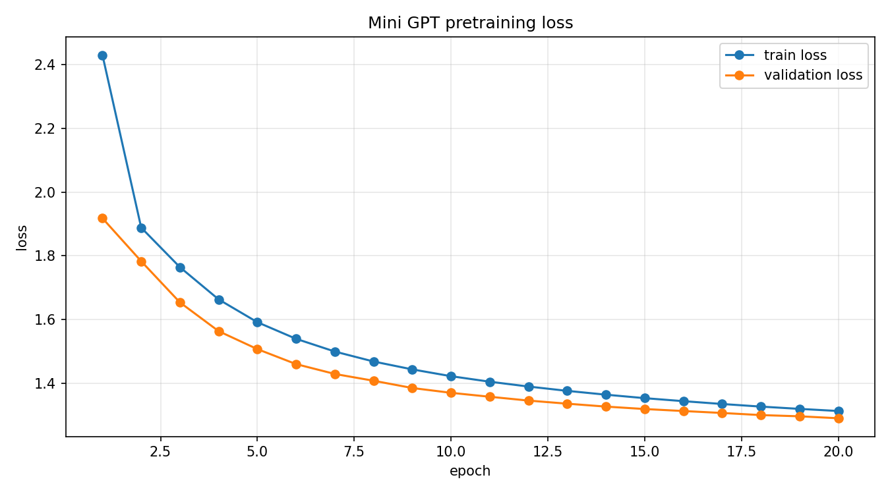
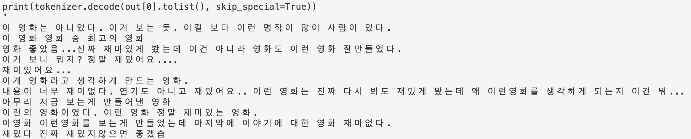
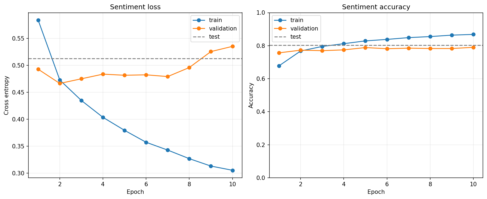
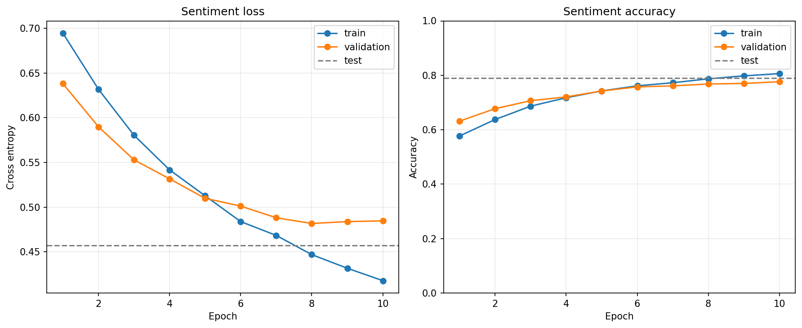
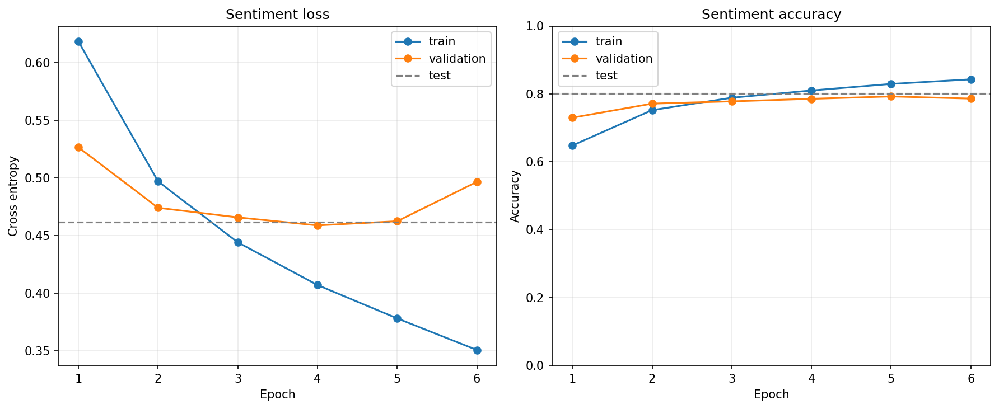
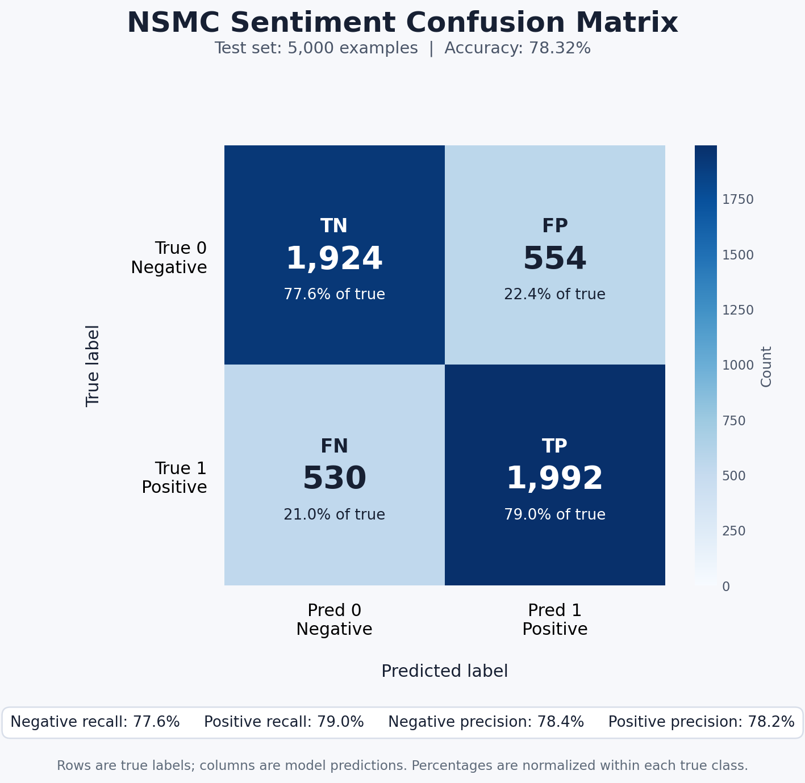
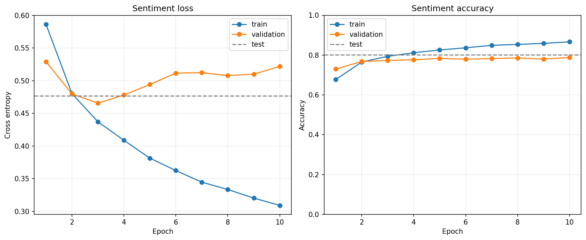
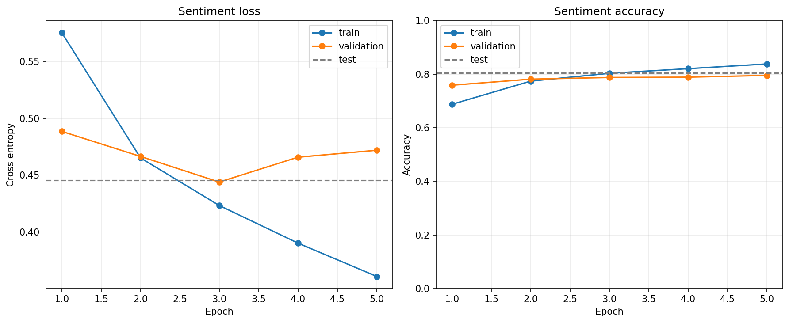

# mini GPT 구현 과제 보고서

## 0. 반·팀원

| 항목 | 내용 |
| --- | --- |
| 반 | 301 (sw-ai 트랙) |
| 팀명 | 작성 필요 |
| 팀원 | 김진호, 김석제, 서원규 |

---

## 1. 구현 현황

| 단계 | 구현 내용 | 구현 파일 | 담당자 |
| --- | --- | --- | --- |
| 1 | UTF-8 byte-level BPE tokenizer 구현 완료 | `src/bpe.py` | 공동 |
| 2 | GPTDataset, create_dataloader, InputEmbedding 구현 완료 | `src/dataset.py`, `src/embeddings.py` | 공동 |
| 3 | MultiHeadAttention, causal mask 구현 완료 | `src/attention.py` | 공동 |
| 4 | LayerNorm, GELU, FeedForward, TransformerBlock, GPTModel, generate_text_simple 구현 완료 | `src/model.py` | 공동 |
| 5 | loss 계산, checkpoint, generate, train_model 구현 완료 | `src/train.py` | 공동 |
| 6 | NSMC 감성 분류 Dataset과 classifier 구현 완료 | `src/finetune.py` | 공동 |

---

## 2. 테스트 통과 현황

| 실행 명령 | 결과 | 비고 |
| --- | --- | --- |
| `pytest tests/test_bpe.py -v` | 통과 | 6 passed |
| `pytest tests/test_dataset.py -v` | 통과 | 4 passed |
| `pytest tests/test_attention.py -v` | 통과 | 2 passed |
| `pytest tests/test_model.py -v` | 통과 | 7 passed |
| `pytest tests/test_train.py -v` | 통과 | 5 passed, matplotlib 비대화형 backend warning 1건 |
| `pytest tests/test_finetune.py -v` | 통과 | 4 passed |
| `pytest tests/ -v` | 통과 | 28 passed, matplotlib 비대화형 backend warning 1건 |

테스트는 원본 프로젝트의 `.venv` Python 3.11.15 환경에서 실행했습니다.
Codex 샌드박스 내부에서는 Windows 임시 폴더 권한 문제로 `tempfile.TemporaryDirectory()`를 쓰는 테스트가 실패했으나, 샌드박스 밖에서 동일 명령을 실행했을 때 전체 테스트가 통과했습니다.

| 실패한 테스트 | 에러 요약 | 해결 시도 |
| --- | --- | --- |
| 없음 | 없음 | 전체 테스트 통과 |

---

## 3. 데이터

| 항목 | 내용 |
| --- | --- |
| 원본 데이터 | NSMC |
| 원본 경로 | `data/ratings_train.txt`, `data/ratings_test.txt` |
| 사전 학습 데이터 | `data/nsmc_lm_train.txt`, `data/nsmc_lm_val.txt` |
| 미세 조정 데이터 | `data/nsmc_sentiment_train.jsonl`, `data/nsmc_sentiment_val.jsonl`, `data/nsmc_sentiment_test.jsonl` |
| 전처리 방식 | 빈 리뷰 제거, 공백 정리, train/validation 분리 |
| 사용한 데이터 크기 | train 35,000개, validation 6,000개, test 5,000개 |

| split | 사용 개수 | 전체 개수 | 비율 |
| --- | ---: | ---: | ---: |
| train | 35,000 | 137,996 | 약 25.4% |
| validation | 6,000 | 11,999 | 약 50.0% |
| test | 5,000 | 49,997 | 약 10.0% |

---

## 4. BPE

| 항목 | 내용 |
| --- | --- |
| 구현 파일 | `src/bpe.py` |
| BPE 방식 | UTF-8 byte-level BPE |
| 특수 토큰 ID | `<pad>=0`, `<unk>=1`, `<bos>=2`, `<eos>=3` |
| byte token ID 범위 | 4~259 |
| vocab_size | 3,000 |
| special tokens | 4 |
| byte tokens | 256 |
| BPE merge tokens | 2,740 |
| merge rules | 2,740 |
| tokenizer 저장 경로 | `data/tokenizer.json` |
| tokenizer 파일 크기 | 318,919 bytes |
| 학습 corpus 크기 | 사전학습 train 문자 1,379,486개, validation 문자 120,560개 |
| 인코딩/디코딩 복원 예시 | 테스트에서 한국어/영어 혼합 문장 encode -> decode 복원 확인 |

`tokenizer.json`은 NSMC language modeling corpus를 바탕으로 학습한 vocabulary와 merge rule을 저장한 파일이다.
외부 tokenizer vocabulary를 사용하지 않고, 직접 구현한 UTF-8 byte-level BPE tokenizer를 사용했다.
사전학습과 미세 조정에서는 같은 tokenizer를 사용해 checkpoint의 embedding table과 입력 token id의 의미가 유지되도록 했다.

---

## 5. 모델 구조

| 항목 | 내용 |
| --- | --- |
| 구현 파일 | `src/model.py` |
| 전체 구조 | InputEmbedding -> N x TransformerBlock -> LayerNorm -> LM head |
| vocab_size | 3,000 |
| context_length | 128 |
| emb_dim | 192 |
| n_heads | 4 |
| n_layers | 4 |
| drop_rate | 0.1 |
| qkv_bias | False |
| 총 파라미터 수 | 약 2.95M |

---

## 6. 사전 학습

### 6.1 하이퍼파라미터

| 구분 | 항목 | 값 |
| --- | --- | --- |
| 데이터 | task | NSMC language modeling |
| 데이터 | train data | `data/nsmc_lm_train.txt` |
| 데이터 | validation data | `data/nsmc_lm_val.txt` |
| 모델 | run_level | BASIC |
| 모델 | tokenizer | `data/tokenizer.json` |
| 모델 | vocab_size | 3,000 |
| 모델 | context_length | 128 |
| 모델 | emb_dim | 192 |
| 모델 | n_heads | 4 |
| 모델 | n_layers | 4 |
| 모델 | drop_rate | 0.1 |
| 모델 | qkv_bias | False |
| 학습 | batch_size | 32 |
| 학습 | num_epochs | 20 |
| 학습 | seed | 42 |
| 학습 | device | CUDA |
| 최적화 | optimizer | AdamW |
| 최적화 | lr, weight_decay | 3e-4, 0.01 |

### 6.2 결과

| 항목 | 내용 |
| --- | --- |
| requested train chars | 1,500,000 |
| actual train chars | 1,379,486 |
| train tokens | 3,335,336 |
| requested validation chars | 200,000 |
| actual validation chars | 120,560 |
| validation tokens | 291,753 |
| global steps | 16,300 |
| final train loss | 1.3138 |
| best validation loss | 1.2911 |
| 손실 그래프 | `figures/pretrain_basic_epoch_loss.png` |
| 생성 샘플 | `figures/LLM.png` |
| best checkpoint 경로 | `checkpoints/pretrain/BASIC_ctx128_emb192_L4_H4_bs32_lr0.0003_chars1500000_val200000_ep20_seed42_20260603_153345/best.pt` |
| final checkpoint 경로 | `checkpoints/pretrain/BASIC_ctx128_emb192_L4_H4_bs32_lr0.0003_chars1500000_val200000_ep20_seed42_20260603_153345/final.pt` |

그래프의 경향을 보면 train loss와 validation loss가 함께 감소하고 있어, 뚜렷한 과적합 없이 학습이 진행되고 있다고 판단했다.
따라서 이 단계에서는 사전학습 성능만 더 끌어올리기보다, 사전학습된 checkpoint를 사용해 미세 조정으로 넘어가 sentiment classification 성능을 확인하는 것이 적절하다고 보았다.

---

## 7. 미세 조정

| 항목 | 내용 |
| --- | --- |
| 구현 파일 | `src/finetune.py` |
| 과제 | NSMC 리뷰 긍정/부정 분류 |
| 데이터 포맷 | JSONL, `text`, `label` |
| max_length | 128 |
| batch_size | 8 |
| pretrained checkpoint | `checkpoints/pretrain/.../best.pt` |
| optimizer | AdamW |
| weight_decay | 0.1 |
| backbone learning rate | 실험별 `1e-4`, `1e-5`, `5e-5` |
| classifier learning rate | backbone과 동일 lr 적용 |
| early stopping | val_loss 기준, patience 2, min_delta 0.001 |
| validation loss / accuracy | best val loss 0.4590, best val acc 0.7900 |
| test loss / accuracy | 최고 test acc 0.8032 |
| 오류 예시 | 애매한 label, 문장 후반부 의미 반전, 강한 부정 단어에 대한 과민 반응 |

### 7.1 실험 결과

| 실험 | lr | epochs | completed | best epoch | best val loss | best val acc | test acc |
| --- | ---: | ---: | ---: | ---: | ---: | ---: | ---: |
| baseline | 1e-4 | 10 | 10 | 10 | 0.5353 | 0.7900 | 0.8032 |
| low lr | 1e-5 | 10 | 10 | 8 | 0.4818 | 0.7680 | 0.7896 |
| mid lr | 5e-5 | 20 | 6 | 4 | 0.4590 | 0.7855 | 0.8012 |

train accuracy는 계속 상승하지만 validation/test 성능은 크게 개선되지 않아, train 데이터에 대한 과적합이 발생하고 있는 것으로 보인다.
실성능은 80% 내외에서 머무르고 있다.
과적합이 발생한다고 판단해 lr과 dropout을 조정하며 결과가 개선되는지 재확인했다.

### 7.2 오류 분석

과적합이 문제라고 생각해 lr과 dropout을 조정했지만 뚜렷한 개선을 확인하지 못했다.
그래서 어떤 데이터에서 문제가 생기는지 확인했다.

confusion matrix를 참고하면 오류가 특정 class 한쪽으로만 치우치지는 않았다.
즉, 학습이 긍정 또는 부정 한쪽으로 편향되었다기보다 개별 문장의 의미 해석에서 문제가 발생한 것으로 보인다.

틀리는 경우의 샘플을 확인해보니 크게 두 가지 유형이 있었다.

1. 데이터 자체가 애매한 경우
2. 문장 안에서 의미가 반전되는 경우

애매한 데이터 예시:

| 항목 | 내용 |
| --- | --- |
| 문장 | 그래도 액션은 볼만했음~ㅎㅎ |
| 실제 label | 부정 |
| 모델 예측 | 긍정 |
| confidence | 0.995 |
| 분석 | 문장만 보면 긍정적으로 보이므로, 댓글만 보고 긍정/부정을 판단하기가 모호한 데이터로 보인다. |

의미 반전 예시:

| 항목 | 내용 |
| --- | --- |
| 문장 | 불륜은 싫지만 이 영화는 도대체 싫어할수가 없다. |
| 실제 label | 긍정 |
| 모델 예측 | 부정 |
| confidence | 0.995 |
| 분석 | 전체적으로는 긍정이지만 앞부분의 "불륜은 싫지만"이라는 강한 부정 표현에 모델이 더 크게 반응한 것으로 보인다. |

| 항목 | 내용 |
| --- | --- |
| 문장 | 어정쩡 하게 끝나는 내용 그리고 지루했으나.. 많은 생각을 들게 해준 영화같다.. |
| 실제 label | 긍정 |
| 모델 예측 | 부정 |
| 분석 | 앞부분에는 부정 표현이 나오고 뒤쪽에서 긍정적 해석이 나오는데, 현재 모델은 이런 "부정 표현 이후 긍정 결론" 구조를 충분히 처리하지 못한 것으로 보인다. |

결론적으로 모델은 명확한 긍정/부정 문장은 비교적 잘 맞추지만, 실제 긍정 리뷰 안에 부정 단어가 섞여 있거나 문장 후반부에서 의미가 반전되는 경우에는 특정 단어에 크게 의존해 전체 의미를 제대로 파악하지 못하는 경향이 있었다.

### 7.3 개선 실험

| 개선 방향 | 근거 | 결과 |
| --- | --- | --- |
| 분류 layer 추가 | 기존 분류기는 Linear layer 하나만 사용하므로, 의미 반전처럼 복잡한 패턴을 학습하기에 표현력이 부족할 수 있다고 판단했다. | 큰 개선을 확인하지 못했다. |
| context_length 증가 | BOS/EOS를 포함한 전체 문맥이 충분히 담기지 않아 맥락 파악이 약할 수 있다고 판단했다. | 의미 있는 변화 확인이 어려웠다. |
| attention head 증가 | 특정 단어에 의존하는 경향을 줄이고 더 다양한 문맥 정보를 취합하기 위해 head 수 증가를 시도했다. | 큰 개선을 확인하지 못했다. |

---

## 8. 실험 환경

| 항목 | 내용 |
| --- | --- |
| Python | 테스트 환경: Python 3.11.15 |
| PyTorch | 설치 환경 기준 |
| 실행 환경 | 로컬 단위 테스트 완료, 학습 실험은 CUDA 환경에서 수행 |
| GPU/CPU 정보 | CUDA 사용 |
| 총 학습 소요 시간 | 실험 기록에 별도 소요 시간 없음 |

---

## 9. 고찰

- 한국어는 음절과 조사, 띄어쓰기 변형이 많기 때문에 외부 tokenizer에 의존하지 않고 UTF-8 byte-level BPE를 직접 구현해 사용했다. 이 방식은 unknown token 문제를 줄일 수 있고, 사전학습과 미세 조정에서 같은 tokenizer를 유지할 수 있다는 장점이 있었다.
- 사전학습에서는 train loss와 validation loss가 함께 감소했으므로 뚜렷한 과적합은 보이지 않았다. best validation loss는 1.2911이었고, final train loss는 1.3138이었다.
- 미세 조정에서는 train accuracy가 계속 상승했지만 validation/test 성능은 약 80% 내외에서 정체되었다. 따라서 데이터에 대한 과적합 또는 모델의 문맥 이해 한계가 있다고 판단했다.
- lr을 1e-4, 1e-5, 5e-5로 바꾸고 dropout 0.2를 적용했지만, test accuracy가 크게 개선되지는 않았다. baseline의 test acc는 0.8032였고, lr을 낮춘 실험들은 0.7896, 0.8012 수준이었다.
- confusion matrix에서는 오류가 한쪽 class로 치우치지 않았다. 대신 틀린 샘플을 보면 애매한 label이 있거나, 부정 표현 뒤에 긍정 결론이 나오는 문장처럼 의미가 반전되는 경우가 많았다.
- 개선을 위해 분류 layer 추가, context_length 증가, attention head 증가를 시도했지만 의미 있는 변화를 찾기는 어려웠다. 다음 개선 방향은 사전학습을 더 오래 진행하거나 더 많은 데이터로 기본 언어 모델 성능을 올리는 것이다.
