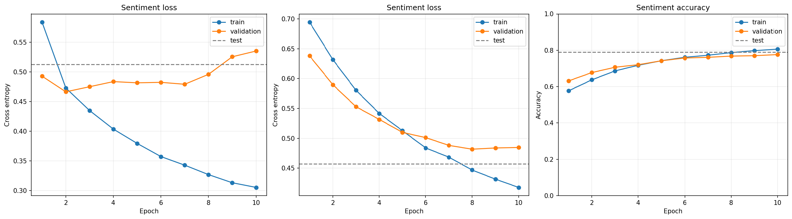
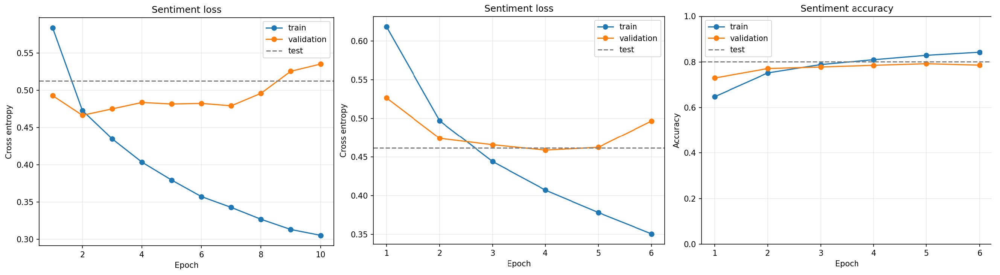
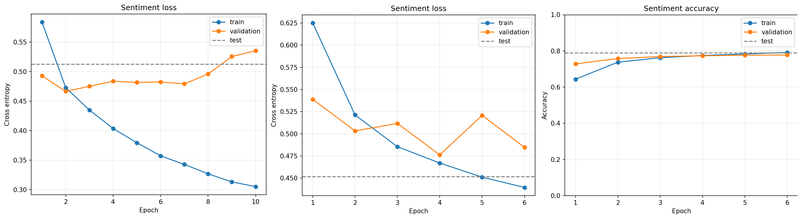
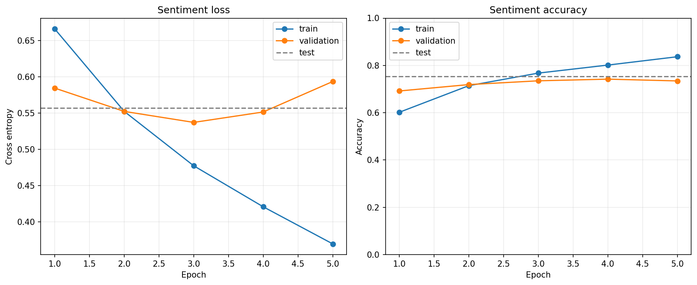

# MiniGPT Sentiment Fine-tuning Report

## 1. 목적
- NSMC sentiment classification 성능 확인
- 사전학습 checkpoint 사용 여부 비교
- validation loss/accuracy 기준으로 과적합 여부 분석

## 2. Vocabulary / Tokenizer

### 2.1 Vocab 생성 방식
| 항목 | 값 |
|---|---:|
| tokenizer type | UTF-8 byte-level BPE |
| 구현 파일 | src/bpe.py |
| 저장 파일 | data/tokenizer.json |
| 파일 크기 | 318,919 bytes |
| vocab_size | 3,000 |
| special tokens | 4 |
| byte tokens | 256 |
| BPE merge tokens | 2,740 |
| merge rules | 2,740 |

`tokenizer.json`은 NSMC language modeling corpus를 바탕으로 학습한 vocabulary와 merge rule을 저장한 파일이다.
외부 tokenizer vocabulary를 사용하지 않고, 직접 구현한 UTF-8 byte-level BPE tokenizer를 사용했다.

### 2.2 Vocab 사용 방식
`tokenizer.json`은 텍스트를 token id로 바꾸기 위한 고정된 사전이며, 모델 가중치는 아니다.
따라서 token embedding table은 `tokenizer.json`에 들어 있지 않고, 사전학습과 미세튜닝 과정에서 모델이 직접 학습한다.

사전학습과 미세튜닝에서는 같은 tokenizer를 사용했다.
이렇게 해야 사전학습된 checkpoint의 embedding table과 미세튜닝 입력 token id가 같은 의미를 유지할 수 있다.

## 3. 공통 설정
- run_level: BASIC
- emb_dim: 192
- n_layers: 4
- n_heads: 4
- context_length: 128
- tokenizer: data/tokenizer.json
- pretrained checkpoint: checkpoints/pretrain/.../best.pt
- optimizer: AdamW
- batch_size: 8
- weight_decay: 0.1
- seed: 42
- early stopping: val_loss, patience 2, min_delta 0.001

## 4. 사전학습

### 4.1 사전학습 설정
| 항목 | 값 |
|---|---:|
| task | NSMC language modeling |
| train data | data/nsmc_lm_train.txt |
| validation data | data/nsmc_lm_val.txt |
| tokenizer | data/tokenizer.json |
| run_level | BASIC |
| vocab_size | 3,000 |
| context_length | 128 |
| emb_dim | 192 |
| n_layers | 4 |
| n_heads | 4 |
| batch_size | 32 |
| epochs | 20 |
| optimizer | AdamW |
| learning rate | 3e-4 |
| weight_decay | 0.01 |
| seed | 42 |
| device | CUDA |

### 4.2 사전학습 데이터와 결과
| 항목 | 값 |
|---|---:|
| requested train chars | 1,500,000 |
| actual train chars | 1,379,486 |
| train tokens | 3,335,336 |
| requested validation chars | 200,000 |
| actual validation chars | 120,560 |
| validation tokens | 291,753 |
| global steps | 16,300 |
| final train loss | 1.3138 |
| best validation loss | 1.2911 |
| best checkpoint | checkpoints/pretrain/BASIC_ctx128_emb192_L4_H4_bs32_lr0.0003_chars1500000_val200000_ep20_seed42_20260603_153345/best.pt |
| final checkpoint | checkpoints/pretrain/BASIC_ctx128_emb192_L4_H4_bs32_lr0.0003_chars1500000_val200000_ep20_seed42_20260603_153345/final.pt |

### 4.3 사전학습 그래프

### 4.4 사전학습 결과 분석
그래프의 경향을 보면 train loss와 validation loss가 함께 감소하고 있어, 뚜렷한 과적합 없이 이상적으로 학습이 진행되고 있다고 판단했다.
따라서 이 단계에서는 사전학습 성능을 더 끌어올리기보다, 사전학습된 checkpoint를 사용해 미세튜닝으로 넘어가서 sentiment classification 성능을 개선하는 것이 더 적절하다고 판단했다.

### 4.5 사전학습 결과

## 5. Fine-tuning

| split | 사용 개수 | 전체 개수 | 비율 |
|---|---:|---:|---:|
| train | 35,000 | 137,996 | 약 25.4% |
| validation | 6,000 | 11,999 | 약 50.0% |
| test | 5,000 | 49,997 | 약 10.0% |

### 5.1 초기 fine-tuning 결과

| 실험 | lr | epochs | completed | best epoch | best val loss | best val acc | test acc |
|---|---:|---:|---:|---:|---:|---:|---:|
| baseline | 1e-4 | 10 | 10 | 10 | 0.5353 | 0.7900 | 0.8032 |

### 5.2 결과 분석
train accuracy는 계속 상승하지만 validation/test 성능은 크게 개선되지 않아, train 데이터에 대한 과적합이 발생하고 있는 것으로 보인다. 실성능은 80% 내외에서 머무르고 있다.
과적합이 발생하고 있다 판단했고, lr과 dropout을 조정해 결과가 개선되는지 재확인해보기로 했다.

## 6 개선사항 적용 결과

### 6.1.1 lr=1e-5

| 실험 | lr | epochs | completed | best epoch | best val loss | best val acc | test acc |
|---|---:|---:|---:|---:|---:|---:|---:|
| baseline | 1e-4 | 10 | 10 | 10 | 0.5353 | 0.7900 | 0.8032 |
| low lr | 1e-5 | 10 | 10 | 8 | 0.4818 | 0.7680 | 0.7896 |

### 6.1.2 lr=5e-5

| 실험 | lr | epochs | completed | best epoch | best val loss | best val acc | test acc |
|---|---:|---:|---:|---:|---:|---:|---:|
| baseline | 1e-4 | 10 | 10 | 10 | 0.5353 | 0.7900 | 0.8032 |
| mid lr | 5e-5 | 20 | 6 | 4 | 0.4590 | 0.7855 | 0.8012 |

### 6.1.3 dropout=0.2 

| 실험 | lr | epochs | completed | best epoch | best val loss | best val acc | test acc |
|---|---:|---:|---:|---:|---:|---:|---:|
| baseline | 1e-4 | 10 | 10 | 10 | 0.5353 | 0.7900 | 0.8032
| dout0.2 | 1e-4 | 10 | 6 |	4 |	0.4763 | 0.7775 | 0.7896

### 6.2 Fine-tuning 결과
 

### 6.3 결과 분석
과적합이 문제라 생각해 lr, drop을 적용해보았지만 개선되는 모습을 확인하지 못했다.
따라서 어떤 데이터에서 문제가 생기는지를 확인해보았다.
 
confision-matirx를 참고하면, 어느쪽으로 오류가 어느쪽으로 치우지지 않고 있다. 학습이 한쪽으로 치우치게 진행되지는 않았다는걸 확인했다.

틀리는 경우가 어떤 경우인지 샘플을 확인해보고 다음 결론을 얻었다.
1. 데이터가 애매한 경우
2. 의미가 반전되는 경우

애매한 데이터 예시1) "그래도 액션은 볼만했음~ㅎㅎ”

실제 label: 부정
모델 예측: 긍정
confidence: 0.995
문장만 보면 꽤 긍정적으로 보인다. 해당 댓글만 보고는 긍정인지 부정인지 판단하기가 모호하다. 충분히 헷갈릴만한 데이터로 보인다.

의미 반전 예시1) “불륜은 싫지만 이 영화는 도대체 싫어할수가 없다.”

실제 label: 긍정
모델 예측: 부정
confidence: 0.995
이 문장은 전체적으로는 긍정이지만, 앞부분에 불륜은 싫지만이라는 강한 부정 표현이 있다. 모델은 문장 전체의 반전 의미보다 부정 단어에 더 강하게 반응한 것으로 보인다.

의미 반전 예시3) “어정쩡 하게 끝나는 내용 그리고 지루했으나.. 많은 생각을 들게 해준 영화같다..”

실제 label: 긍정
모델 예측: 부정
여기서도 어정쩡, 지루했으나 같은 부정 표현이 앞에 나오고, 긍정적 해석은 뒤쪽에 나온다. 현재 모델은 이런 “부정 표현 이후 긍정 결론”을 충분히 잘 처리하지 못하는 것 같다.

결론: 모델이 문장 전체의 감정보다 일부 강한 부정 표현에 끌리는 경향이 있다.
이 결과를 보면 모델은 명확한 긍정/부정 문장은 잘 맞춘다.
하지만 실제 긍정 리뷰 안에 부정 단어가 섞여 있거나, 문장 후반부에서 의미가 반전되는 경우에는 특정 단어에 크게 의존해 의미를 제대로 파악하지 못한다.

### 6.4 개선 방향
1. 분류에 사용되는 레이어 추가
2. context_length 증가
3. num_multihead 증가

<1번 근거>
분류에는 LinearLayer 층 하나만 사용되고 있다. fine-tuning을 통해 학습이 되고 있는데, 반전되는 의미를 이해하기에 복잡도가 작을 수 있겠다는 생각이 들었다. perceptron에서 층 1개로 XOR 연산을 만들수 없던것처럼, 어쩌면 층이 부족해 의미 반전이 어렵지 않나 생각이 들었다. 따라서 Linear-Layer(192->192) 를 추가해보기로 결정했다.

<2번 근거>
AI의 도움을 통해, fine-tuning에 사용되는 데이터를 한 행에 담기엔 현재 context_length(128) 작다는 의견을 받았다. BOS, EOS 같은 특수 문자까지를 포함한 문맥 벡터가 만들어지지 않아, 맥락을 제대로 파악하지 못하는게 아닌가 싶었다. 따라서 context_length를 증가시켜보는 시도를 결정했다.

<3번 근거>
의미가 반전되는걸 파악하지 못했다면, 문맥에서 특정 단어들에 의존하고 있는게 아닌가 하는 생각이 들었다. attention 쪽에서 head 수를 늘려보는 의견을 받았다. 더 다양한 문맥 정보를 취합한다면, 반전 의미를 파악할 수 있지 않을까 생각했고, 시도를 결정했다.

## 7. 개선사항 적용 결과
### 7.1 Linear-Layer 추가

### 7.2 context_length 증가

### 7.3 attention head 증가

### 7.4 결과 분석
여러번 시도를 해봤지만, 의미있는 변화를 찾기는 어려웠다. 
아직 원인을 제대로 찾지 못했고, 가장 쉬운 방법은 사전 훈련을 더 진행해, 모델 기본 성능 자체를 올리는 것이 가장 좋을 것 같다는 판단이 들었다.

## 8. 회고
### 8.1 어려웠던 점
1. 파인 튜닝쪽에 힘들 쏟았는데 어떤 시도를 주든 과적합을 피할 수 없었다. val 성능도 80% 근처를 벗어나지 못했고, 이유도 잡지 못했다. 여러가지 시도는 재밌었지만, 명확한 원인을 찾지 못한것이 아쉬웠다.
2. 개념이 부족해 파인튜닝 자료로 사전 훈련을 돌렸었다. 
